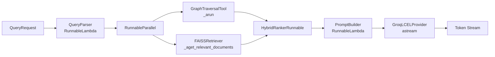

# Design Document: LangChain Integration

## Overview

This design adds LangChain as a thin orchestration layer over the existing Graph RAG system.
The goal is to re-express the imperative `answer_query` pipeline as an LCEL (LangChain
Expression Language) chain, wrap the Neo4j traversal as a `BaseTool`, wrap the FAISS store
as a `BaseRetriever`, and wrap the Groq streaming LLM as a `Runnable` — all without touching
any existing business-logic class.

The new module `backend/services/lcel_pipeline.py` is the only net-new file. Four thin
wrapper classes live inside it. The FastAPI route handler changes by one import and one
function call. Every existing class (`GraphTraversal`, `VectorStore`, `HybridRanker`,
`GroqProvider`, `QueryParser`) is unchanged.

### Design Goals

- Zero modification to existing components
- Drop-in replacement for `answer_query` at the FastAPI layer
- Async-first, streaming-native pipeline
- Optional LangSmith observability via environment variable
- Forward-compatible with a future LangGraph agent upgrade

---

## Architecture

The pipeline replaces the five-step imperative sequence in `query_service.py` with an
equivalent LCEL chain. The data flow is identical; only the orchestration mechanism changes.



### Module Layout

```
backend/
  services/
    query_service.py        # unchanged (kept for reference / fallback)
    lcel_pipeline.py        # NEW — all four wrappers + chain assembly
  ...
```

No other files are added or modified except:
- `backend/requirements.txt` — three new dependency lines
- `backend/main.py` — pipeline initialised in `lifespan`
- `backend/api/routes/query.py` — one import swap

---

## Components and Interfaces

### 1. GraphTraversalTool

Subclasses `langchain_core.tools.BaseTool`. Wraps `GraphTraversal.multi_hop`.

```python
class GraphTraversalTool(BaseTool):
    name: str = "graph_traversal"
    description: str = "Traverses the Neo4j knowledge graph using BFS/DFS multi-hop..."
    _traversal: GraphTraversal  # injected

    async def _arun(self, query: ParsedQuery) -> list[TraversalNode]: ...
    def _run(self, *args, **kwargs): raise NotImplementedError
```

- Constructor accepts a `GraphTraversal` instance (no new Neo4j client created).
- `_arun` catches all exceptions, logs them, and returns `[]` on failure.
- `_run` raises `NotImplementedError` — async-only.
- Compatible with `langgraph.prebuilt.create_react_agent` tool registration (Req 8.1).

### 2. FAISSRetriever

Subclasses `langchain_core.retrievers.BaseRetriever`. Wraps `VectorStore.search`.

```python
class FAISSRetriever(BaseRetriever):
    _store: VectorStore
    top_k: int = 10

    def _get_relevant_documents(self, query: str) -> list[Document]: ...
    async def _aget_relevant_documents(self, query: str) -> list[Document]: ...
```

- Returns `langchain_core.documents.Document` objects with:
  - `page_content` = chunk text
  - `metadata` = `{"chunk_id": ..., "doc_id": ..., "page_number": ...}`
- Empty FAISS index returns `[]` without raising.
- Convertible to a LangGraph tool via `create_retriever_tool` (Req 8.2).

### 3. HybridRankerRunnable

Implemented as a `RunnableLambda` wrapping `HybridRanker.rank`.

```python
def _make_ranker_runnable(ranker: HybridRanker, top_k: int) -> RunnableLambda:
    def _rank(inputs: dict) -> list[RankedChunk]:
        return ranker.rank(
            graph_results=inputs["graph_results"],
            vector_results=inputs["vector_results"],
            top_k=top_k,
        )
    return RunnableLambda(_rank)
```

- Input dict keys: `"graph_results"` (`list[TraversalNode]`), `"vector_results"` (`list[VectorMatch]`).
- Output: `list[RankedChunk]`.
- No RRF logic is duplicated — delegates entirely to `HybridRanker.rank`.

### 4. GroqLCELProvider

Subclasses `langchain_core.runnables.RunnableSerializable`. Wraps `GroqProvider.stream`.

```python
class GroqLCELProvider(RunnableSerializable):
    _provider: GroqProvider

    async def astream(self, input: str, config=None, **kwargs) -> AsyncIterator[str]: ...
    def invoke(self, input: str, config=None) -> str: ...  # collects stream
```

- `astream` delegates directly to `GroqProvider.stream` — no buffering.
- Exceptions from the Groq API propagate to the caller (Req 5.4).
- Does not replace `GroqProvider` or `LLMRouter` (Req 5.5).

### 5. LCEL Pipeline Assembly

```python
def build_pipeline(
    parser: QueryParser,
    traversal: GraphTraversal,
    store: VectorStore,
    ranker: HybridRanker,
    groq: GroqProvider,
    top_k: int = 10,
) -> Runnable:
    parse_step = RunnableLambda(lambda req: parser.parse(req.question))

    retrieval_step = RunnableParallel({
        "graph_results": GraphTraversalTool(traversal=traversal),
        "vector_results": FAISSRetriever(store=store, top_k=top_k),
    })

    rank_step = _make_ranker_runnable(ranker, top_k)

    prompt_step = RunnableLambda(lambda ranked: build_rag_prompt(...))

    llm_step = GroqLCELProvider(provider=groq)

    return (
        parse_step
        | retrieval_step
        | rank_step
        | prompt_step
        | llm_step
    ).with_config({"run_name": "graph-rag-query"})
```

The pipeline is a singleton built once in `lifespan` and stored on `app.state`.

### 6. Redis Cache Integration

The existing Redis cache check is preserved as a `RunnableLambda` guard that short-circuits
the chain when a cached answer exists:

```python
async def _cache_guard(request: QueryRequest) -> str | None:
    cached = await redis_client.get(request.question)
    return cached  # None → proceed; str → return immediately

cache_step = RunnableLambda(_cache_guard)
```

The full pipeline becomes: `cache_step | RunnableBranch(cached_path, full_pipeline)`.

---

## Data Models

No new Pydantic models are introduced. The pipeline reuses existing types throughout:

| Stage | Input Type | Output Type |
|---|---|---|
| QueryParser step | `QueryRequest` | `ParsedQuery` |
| GraphTraversalTool | `ParsedQuery` | `list[TraversalNode]` |
| FAISSRetriever | `str` (query text) | `list[Document]` |
| HybridRankerRunnable | `dict[str, list]` | `list[RankedChunk]` |
| PromptBuilder step | `list[RankedChunk]` | `str` |
| GroqLCELProvider | `str` | `AsyncIterator[str]` |

The `RunnableParallel` step requires a small adapter: the `ParsedQuery` is fanned out so
`GraphTraversalTool` receives the full `ParsedQuery` and `FAISSRetriever` receives
`parsed.original` (the raw query string). This adapter is a `RunnableLambda`.

The `HybridRankerRunnable` input dict is assembled from the parallel outputs:
- `"graph_results"` ← `GraphTraversalTool` output (`list[TraversalNode]`)
- `"vector_results"` ← `FAISSRetriever` output converted back from `list[Document]` to
  `list[VectorMatch]` via a thin adapter lambda.

### Dependency Additions (`backend/requirements.txt`)

```
langchain-core>=0.2.0
langchain>=0.2.0
langchain-groq>=0.1.0
# langsmith>=0.1.0  # optional: enable with LANGCHAIN_TRACING_V2=true
```

---


## Correctness Properties

*A property is a characteristic or behavior that should hold true across all valid executions of a system — essentially, a formal statement about what the system should do. Properties serve as the bridge between human-readable specifications and machine-verifiable correctness guarantees.*

### Property 1: Pipeline output equivalence

*For any* `QueryRequest`, the token stream produced by `lcel_pipeline.astream(request)` should
be equivalent to the token stream produced by the original `answer_query(request)` when both
are given the same mocked underlying components.

**Validates: Requirements 1.1, 6.2**

---

### Property 2: Graph traversal fallback

*For any* `QueryRequest`, if `GraphTraversalTool._arun` raises an exception, the pipeline
should still complete and yield tokens derived solely from `FAISSRetriever` results, without
propagating the exception to the caller.

**Validates: Requirements 1.5**

---

### Property 3: GraphTraversalTool delegation

*For any* `ParsedQuery`, calling `GraphTraversalTool._arun(query)` should return the same
list of `TraversalNode` objects as calling `GraphTraversal.multi_hop(query)` directly.

**Validates: Requirements 2.2**

---

### Property 4: GraphTraversalTool error containment

*For any* exception type raised by `GraphTraversal.multi_hop`, `GraphTraversalTool._arun`
should catch it and return an empty list rather than propagating the exception.

**Validates: Requirements 2.4**

---

### Property 5: FAISSRetriever document mapping

*For any* list of `VectorMatch` objects returned by `VectorStore.search`, the corresponding
`Document` objects returned by `FAISSRetriever._aget_relevant_documents` should have
`page_content` equal to the match's `text` and `metadata` containing the correct `chunk_id`,
`doc_id`, and `page_number` values.

**Validates: Requirements 3.2**

---

### Property 6: FAISSRetriever empty result (edge case)

*For any* query string, when `VectorStore.search` returns an empty list,
`FAISSRetriever._aget_relevant_documents` should return an empty list without raising an
exception.

**Validates: Requirements 3.6**

---

### Property 7: HybridRankerRunnable output equivalence

*For any* dict containing `"graph_results"` (list of `TraversalNode`) and `"vector_results"`
(list of `VectorMatch`), invoking `HybridRankerRunnable` should return the same list of
`RankedChunk` objects as calling `HybridRanker.rank(graph_results, vector_results)` directly.

**Validates: Requirements 4.2, 4.3**

---

### Property 8: GroqLCELProvider token forwarding

*For any* prompt string and any sequence of tokens yielded by a mocked `GroqProvider.stream`,
`GroqLCELProvider.astream` should yield exactly the same tokens in the same order without
buffering or dropping any.

**Validates: Requirements 5.2**

---

### Property 9: GroqLCELProvider error propagation

*For any* exception raised by `GroqProvider.stream` during iteration, `GroqLCELProvider.astream`
should propagate that exception to the caller rather than swallowing it or returning a partial
result.

**Validates: Requirements 5.4**

---

### Property 10: Cache short-circuit

*For any* `QueryRequest` whose question has a cached response in Redis, the pipeline should
return the cached response and the `GroqLCELProvider` should never be invoked.

**Validates: Requirements 6.3**

---

## Error Handling

| Failure Point | Behaviour |
|---|---|
| `GraphTraversal.multi_hop` raises | `GraphTraversalTool` catches, logs, returns `[]`; pipeline continues with vector-only results |
| `VectorStore.search` returns `[]` | `FAISSRetriever` returns `[]`; `HybridRanker.rank` receives empty vector list; pipeline continues |
| Both retrieval steps return `[]` | `HybridRanker.rank` returns `[]`; prompt is built with no context; LLM generates a "no information" response |
| `GroqProvider.stream` raises | Exception propagates through `GroqLCELProvider` to the FastAPI route handler, which returns HTTP 500 |
| Redis unavailable | Cache guard catches the connection error, logs it, and falls through to the full pipeline |
| `QueryParser.parse` raises | Exception propagates; FastAPI returns HTTP 422 (invalid input) |

All error paths are logged using Python's standard `logging` module at `WARNING` or `ERROR`
level. No `print` statements are used in the new module.

---

## Testing Strategy

### Dual Testing Approach

Both unit tests and property-based tests are required. They are complementary:
- Unit tests cover specific examples, integration points, and edge cases.
- Property tests verify universal correctness across randomly generated inputs.

### Property-Based Testing

The property-based testing library is **Hypothesis** (already in `requirements.txt` as
`hypothesis>=6.100.0`). Each property test runs a minimum of 100 iterations.

Each test is tagged with a comment referencing the design property:
```python
# Feature: langchain-integration, Property N: <property_text>
```

**Property test mapping:**

| Property | Test | Strategy |
|---|---|---|
| P1: Pipeline equivalence | `test_pipeline_equivalence` | `st.builds(QueryRequest, ...)` |
| P2: Graph fallback | `test_graph_fallback` | `st.builds(QueryRequest, ...)` with failing traversal mock |
| P3: Traversal delegation | `test_traversal_tool_delegation` | `st.builds(ParsedQuery, ...)` |
| P4: Traversal error containment | `test_traversal_tool_error_containment` | `st.sampled_from([Exception, RuntimeError, ...])` |
| P5: FAISS document mapping | `test_faiss_document_mapping` | `st.lists(st.builds(VectorMatch, ...))` |
| P6: FAISS empty result | `test_faiss_empty_result` | fixed empty list |
| P7: Ranker equivalence | `test_ranker_runnable_equivalence` | `st.lists(...)` for both inputs |
| P8: Groq token forwarding | `test_groq_token_forwarding` | `st.lists(st.text())` for token sequences |
| P9: Groq error propagation | `test_groq_error_propagation` | `st.sampled_from([Exception, ValueError, ...])` |
| P10: Cache short-circuit | `test_cache_short_circuit` | `st.builds(QueryRequest, ...)` with cache mock |

### Unit Tests

Unit tests live in `backend/tests/test_lcel_pipeline.py` and cover:
- Structural contracts: `GraphTraversalTool` has `name="graph_traversal"` and non-empty `description`
- `_run` raises `NotImplementedError`
- `FAISSRetriever` is a `BaseRetriever` subclass
- `HybridRankerRunnable` is a `Runnable` instance
- `GroqLCELProvider` is a `Runnable` instance
- Pipeline has `run_name = "graph-rag-query"` in config
- Pipeline operates without LangSmith env vars set
- `GraphTraversalTool` is compatible with `create_react_agent` tool registration
- `FAISSRetriever` is convertible via `create_retriever_tool`
- `requirements.txt` contains the three new LangChain dependencies

### Test File Location

```
backend/tests/test_lcel_pipeline.py   # all new tests
```

Existing test files (`test_chunker.py`, `test_hybrid_ranker.py`) are unchanged.
