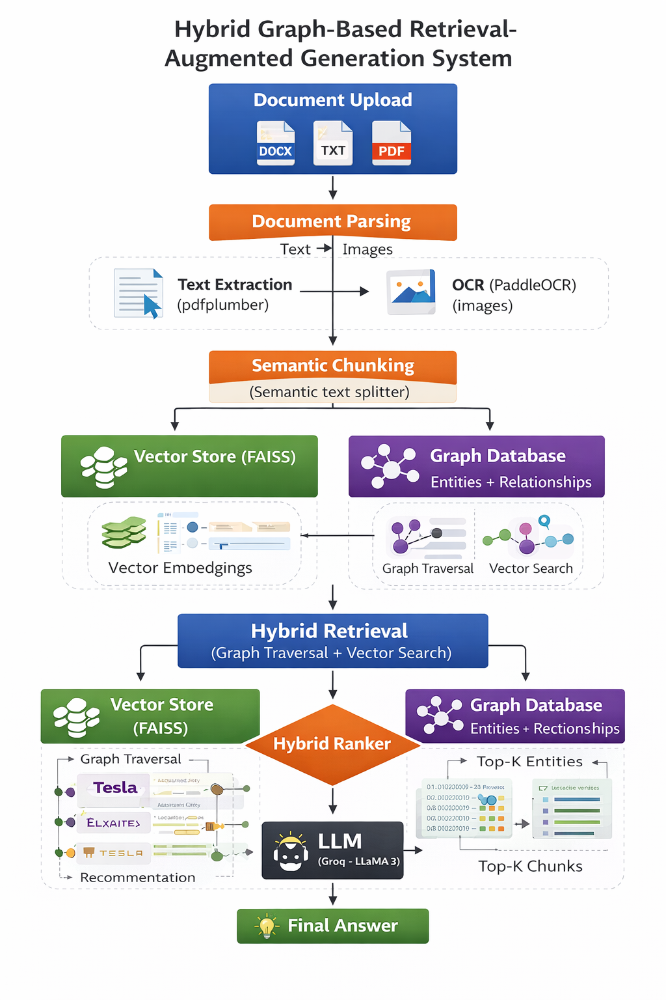

# Graph RAG System

A Retrieval-Augmented Generation (RAG) system that combines a **knowledge graph** (Neo4j) with **vector search** (FAISS) to answer questions over uploaded documents. Documents are parsed, chunked, entity-extracted, and stored as a graph — queries traverse that graph and rank results with a hybrid ranker before streaming an LLM answer.

## Workflow



---

## Architecture

```
Documents (PDF, DOCX, TXT, images)
        │
        ▼
  DocumentParser (pdfplumber / PaddleOCR)
        │
        ▼
  SemanticChunker  ──►  VectorStore (FAISS + sentence-transformers)
        │
        ▼
  EntityExtractor (spaCy)
        │
        ▼
  Neo4j Graph  (Document → Chunk → Entity nodes)
        │
        ▼
  Query: GraphTraversal + VectorSearch → HybridRanker → Groq LLM (streaming)
```

**Stack**

| Layer | Technology |
|---|---|
| Backend | FastAPI + Python 3.12 |
| Graph DB | Neo4j 5.19 (Graph Data Science plugin) |
| Vector Store | FAISS + `all-MiniLM-L6-v2` embeddings |
| NLP | spaCy `en_core_web_sm` |
| LLM | Groq API (`llama-3.3-70b-versatile`) |
| Frontend | React + TypeScript + Vite + Tailwind CSS |
| Container | Docker Compose |

---

## Prerequisites

- Docker & Docker Compose
- A [Groq API key](https://console.groq.com)
- (Optional) CUDA GPU — set `USE_GPU=true` in `.env` for faster OCR

---

## Quick Start

### 1. Configure environment

Create a `.env` file in the project root:

```env
GROQ_API_KEY=your_groq_api_key_here
LLM_MODEL=llama-3.3-70b-versatile

NEO4J_URI=bolt://neo4j:7687
NEO4J_USER=neo4j
NEO4J_PASSWORD=password

EMBEDDING_MODEL=all-MiniLM-L6-v2
MAX_UPLOAD_SIZE_MB=100
CORS_ORIGINS=["http://localhost:5173"]
USE_GPU=false
```

### 2. Start all services

```bash
docker compose up --build
```

This starts:
- Neo4j at `http://localhost:7474` (browser UI) / `bolt://localhost:7687`
- Backend API at `http://localhost:8000`
- Frontend at `http://localhost:5173`

### 3. Install the spaCy model (first run)

```bash
docker compose exec backend python -m spacy download en_core_web_sm
```

---

## Running Without Docker

### Backend

```bash
cd graph-rag-system
python -m venv .venv
.venv\Scripts\activate        # Windows
# source .venv/bin/activate   # macOS/Linux

pip install -r backend/requirements.txt
python -m spacy download en_core_web_sm
uvicorn backend.main:app --reload --port 8000
```

### Frontend

```bash
cd frontend
npm install
npm run dev
```

---

## API Endpoints

| Method | Path | Description |
|---|---|---|
| `POST` | `/api/documents/upload` | Upload a document (PDF, DOCX, TXT, image) |
| `GET` | `/api/documents/{doc_id}/status` | Poll ingestion status |
| `POST` | `/api/query` | Ask a question (streaming SSE response) |
| `GET` | `/api/graph/{doc_id}` | Fetch graph nodes/edges for a document |
| `GET` | `/health` | Health check (includes Neo4j status) |

---

## Project Structure

```
graph-rag-system/
├── backend/
│   ├── api/routes/         # FastAPI route handlers
│   ├── graph/              # Neo4j client, graph builder, traversal
│   ├── llm/                # Groq provider, prompt builder
│   ├── models/             # Pydantic models
│   ├── nlp/                # OCR, chunker, entity extractor, query parser
│   ├── services/           # Ingestion & query orchestration
│   ├── vector/             # FAISS store, hybrid ranker
│   ├── config.py           # Settings (pydantic-settings)
│   ├── main.py             # FastAPI app entry point
│   └── requirements.txt
├── frontend/
│   └── src/
│       ├── components/
│       │   ├── ChatPanel/      # Streaming chat UI
│       │   ├── DocumentUpload/ # File upload with status polling
│       │   └── GraphViewer/    # Cytoscape.js graph visualization
│       └── api/client.ts       # API client
├── vector_store/           # Persisted FAISS index
├── docker-compose.yml
└── .env
```

---

## How It Works

1. **Ingestion** — Upload a document. The backend parses it (PDF text extraction or OCR for scanned pages), splits it into semantic chunks, extracts named entities with spaCy, stores everything as a graph in Neo4j, and indexes chunk embeddings in FAISS.

2. **Query** — Ask a question. The query is parsed to identify entities, a multi-hop BFS traversal finds relevant chunks via the graph, vector search finds semantically similar chunks, a hybrid ranker merges both result sets, and the final context is streamed through Groq's LLM.

3. **Visualization** — The frontend renders the document's entity graph using Cytoscape.js so you can explore relationships visually.

---

## Testing

```bash
cd backend
pytest tests/ -v
```

Tests use `pytest-asyncio` and `hypothesis` for property-based testing.

---

## Configuration Reference

| Variable | Default | Description |
|---|---|---|
| `GROQ_API_KEY` | — | Required. Groq API key |
| `LLM_MODEL` | `llama-3.3-70b-versatile` | Groq model name |
| `NEO4J_URI` | `bolt://localhost:7687` | Neo4j connection URI |
| `NEO4J_USER` | `neo4j` | Neo4j username |
| `NEO4J_PASSWORD` | `password` | Neo4j password |
| `EMBEDDING_MODEL` | `all-MiniLM-L6-v2` | Sentence-transformers model |
| `MAX_UPLOAD_SIZE_MB` | `100` | Max document upload size |
| `USE_GPU` | `false` | Enable GPU for OCR/embeddings |
